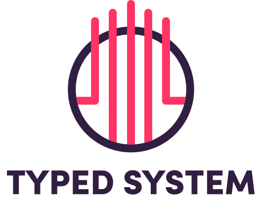

<h1 align="center">
  <a href="https://github.com/typed-system/typed-system/">
    
  </a>
</h1>
<p align="center">Toolkit to create your own Design System.</p>

<div align="center">
  <a href="https://github.com/typed-system/typed-system/blob/master/LICENSE">
    
  </a>
  <a href="https://circleci.com/gh/typed-system/typed-system">
    
  </a>
  <a href="https://codecov.io/gh/typed-system/typed-system">
    
  </a>
  
</div>

## Getting Started

TODO

## Packages

### Core

| Package | Version | Docs | Description |
| --- | --- | --- | --- |
| [`@typed-system/typed-system`](https://github.com/typed-system/typed-system/tree/master/packages/typed-system) | [](https://www.npmjs.com/package/@typed-system/typed-system) | [Link](https://github.com/typed-system/typed-system/tree/master/packages/typed-system) | All-in-one Package (Re-Exports all Module Packages in one big file) |
| [`@typed-system/react-engine`](https://github.com/typed-system/typed-system/tree/master/packages/react-engine) | [](https://www.npmjs.com/package/@typed-system/react-engine) | [Link](https://github.com/typed-system/typed-system/tree/master/packages/react-engine) | React-Engine |
| [`@typed-system/css`](https://github.com/typed-system/typed-system/tree/master/packages/css) | [](https://www.npmjs.com/package/@typed-system/css) | [Link](https://github.com/typed-system/typed-system/tree/master/packages/css) | CSS |

### Modules

| Package | Version | Docs | Description |
| --- | --- | --- | --- |
| [`@typed-system/background`](https://github.com/typed-system/typed-system/tree/master/packages/background) | [](https://www.npmjs.com/package/@typed-system/background) | [Link](https://github.com/typed-system/typed-system/tree/master/packages/background) | Background |
| [`@typed-system/border`](https://github.com/typed-system/typed-system/tree/master/packages/border) | [](https://www.npmjs.com/package/@typed-system/border) | [Link](https://github.com/typed-system/typed-system/tree/master/packages/border) | Border |
| [`@typed-system/color`](https://github.com/typed-system/typed-system/tree/master/packages/color) | [](https://www.npmjs.com/package/@typed-system/color) | [Link](https://github.com/typed-system/typed-system/tree/master/packages/color) | Color |
| [`@typed-system/flexbox`](https://github.com/typed-system/typed-system/tree/master/packages/flexbox) | [](https://www.npmjs.com/package/@typed-system/flexbox) | [Link](https://github.com/typed-system/typed-system/tree/master/packages/flexbox) | Flexbox |
| [`@typed-system/grid`](https://github.com/typed-system/typed-system/tree/master/packages/grid) | [](https://www.npmjs.com/package/@typed-system/grid) | [Link](https://github.com/typed-system/typed-system/tree/master/packages/grid) | Grid |
| [`@typed-system/layout`](https://github.com/typed-system/typed-system/tree/master/packages/layout) | [](https://www.npmjs.com/package/@typed-system/layout) | [Link](https://github.com/typed-system/typed-system/tree/master/packages/layout) | Layout |
| [`@typed-system/position`](https://github.com/typed-system/typed-system/tree/master/packages/position) | [](https://www.npmjs.com/package/@typed-system/position) | [Link](https://github.com/typed-system/typed-system/tree/master/packages/position) | Position |
| [`@typed-system/shadow`](https://github.com/typed-system/typed-system/tree/master/packages/shadow) | [](https://www.npmjs.com/package/@typed-system/shadow) | [Link](https://github.com/typed-system/typed-system/tree/master/packages/shadow) | Shadow |
| [`@typed-system/spacing`](https://github.com/typed-system/typed-system/tree/master/packages/spacing) | [](https://www.npmjs.com/package/@typed-system/spacing) | [Link](https://github.com/typed-system/typed-system/tree/master/packages/spacing) | Spacing |
| [`@typed-system/typography`](https://github.com/typed-system/typed-system/tree/master/packages/typography) | [](https://www.npmjs.com/package/@typed-system/typography) | [Link](https://github.com/typed-system/typed-system/tree/master/packages/typography) | Typography |
| [`@typed-system/variant`](https://github.com/typed-system/typed-system/tree/master/packages/variant) | [](https://www.npmjs.com/package/@typed-system/variant) | [Link](https://github.com/typed-system/typed-system/tree/master/packages/variant) | Variant |

## API

TODO

## Philosophy

TODO

- Why am I building this?
- Comparision vs styled-system, styletron, styled-components, emotion etc.
- Benchmarks

## Roadmap

TODO

## Workflow

Initalize this monorepo by running:

```shell
yarn
```

Build all packages:

```shell
yarn lerna run build
```

Build one package:

```shell
yarn lerna run --scope package-name build
```

e.g. the following will only build the `@typed-system/css` package:

```shell
yarn lerna run --scope @typed-system/css build
```

See [`filter-options`](https://github.com/lerna/lerna/tree/master/core/filter-options) for more options.
